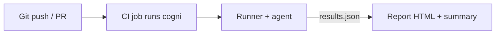

# cogni MVP Build Spec
A cognitive benchmarking tool for measuring how easy a codebase is to understand and change.

> **Goal:** Build a repeatable set of repo-specific questions ("cognitive tests") that an instrumented AI agent answers, then track correctness and effort metrics over time to quantify maintainability and surface technical debt.

---

## 0) What we are building
We are building a tool for "Cognitive benchmarking" (aka "Cognitive tests"). It evaluates codebase complexity by probing it with questions about key product features from a product or stakeholder point of view. We ask an agent to answer each question and measure the resources it took (tokens, time, tool usage). We trend those metrics over commits to evaluate code quality and maintainability, exposing technical debt to all stakeholders.

---

## 0.1) User tutorial (from a user's point of view)
This is how cogni looks in day-to-day use for a repo owner.

1) Add questions
   - Start with `cogni init` to scaffold `.cogni.yml` and a `schemas/` folder.
   - Define `qa` tasks with prompts tied to key product features and stakeholder concerns.
   - Require citations so answers are traceable to code.
   - Set the output folder once in `.cogni.yml` so CLI commands stay short.
   - Example questions for the future cogni codebase:

     ```yaml
     repo:
       output_dir: "./cogni-results"
     agent:
       max_steps: 25
       temperature: 0.0
     tasks:
       - id: cli_command_map
         type: qa
         prompt: >
           List the CLI commands supported by cogni and where each is implemented.
           Return JSON with keys:
           {"commands":[{"name":...,"file":...,"description":...}],"citations":[{"path":...,"lines":[start,end]}]}
         eval:
           must_contain_strings: ["commands", "citations"]
           validate_citations: true
         budget:
           max_tokens: 8000
           max_seconds: 120
       - id: report_generation_flow
         type: qa
         prompt: >
           Explain how cogni generates report.html, including which inputs it reads and how it
           summarizes results. Return JSON with keys:
           {"inputs":[...],"outputs":[...],"steps":[...],"citations":[{"path":...,"lines":[start,end]}]}
         eval:
           must_contain_strings: ["inputs", "outputs", "citations"]
           validate_citations: true
         budget:
           max_tokens: 9000
           max_seconds: 120
       - id: results_json_summary
         type: qa
         prompt: >
           Describe how results.json is structured and where summary metrics are computed.
           Return JSON with keys:
           {"summary_fields":[...],"computation":[...],"citations":[{"path":...,"lines":[start,end]}]}
         eval:
           must_contain_strings: ["summary_fields", "citations"]
           validate_citations: true
         budget:
           max_tokens: 9000
           max_seconds: 120
     ```

2) Validate the spec
   - `cogni validate` ensures YAML and JSON schemas are correct before running.

3) Run the benchmark
   - `cogni run` (runs the whole benchmark at the current commit)
   - `cogni run question-id1 question-id2` (run a subset)
   - Produces `results.json` and `report.html` under `<output_dir>/<commit>/<run-id>/`
   - Prints a terminal summary with pass rate and resource usage.

4) Compare runs in the CLI
   - `cogni compare --base main` (compare the current commit against main)
   - `cogni compare --range main..HEAD`
   - For `--range`, cogni queries the repo to expand the commit list, then compares the runs in that window.
   - Shows deltas in pass rate, tokens, and time, plus any questions that regressed.

5) Produce and view a report
   - `cogni report --range main..HEAD --open`
   - For `--range`, cogni queries the repo to expand the commit list and renders trends for that window.
   - Use a directory with multiple runs to render trend charts.

---

## 1) MVP outcome
By the end of the MVP, a developer should be able to:

1. Add a file like `.cogni.yml` to a repo defining **Q&A probes** (questions).
2. Run a single command (locally or in CI) to execute the suite against a commit:
   - `cogni run`
   - `cogni run question-id1 question-id2`
3. Automatically collect metrics per question:
   - **correctness**: pass/fail (objective checks)
   - **effort/cost**: tokens, wall time, tool calls, unique files read, search calls
4. Store results keyed by commit SHA under the configured output folder.
5. View a minimal dashboard/report generated by the CLI:
   - pass rate trend
   - tokens trend
   - time trend
   - latest run table (per question pass/fail + key metrics)

---

## 2) Non-goals (explicitly out of scope for MVP)
- Code-changing tasks (patches, tests, linting)
- Sandboxed runners or Docker isolation
- SaaS/hosted results API, multi-tenant support, RBAC, SSO, team permissions
- Sophisticated semantic correctness scoring / LLM-as-judge
- Perfect attribution of "files opened" from an external agent UI
- Automatic task generation from repo (tasks are manually written by developers)
- General code-quality rules (this is not a linter/SAST product)

---

## 3) High-level architecture
For MVP, build two parts:

1) **Task Suite Spec** (in the repo): `.cogni.yml` + optional JSON schemas  
2) **CLI Runner + Instrumented Agent + Report Generator**: single Go binary invoked locally or by CI

The CLI runs the questions, writes `results.json`, and generates a local HTML report (plus a terminal summary).

### MVP data flow


---

## 4) Tech choices (recommended defaults)

These are suggestions; dev can swap if preferred.

* **Runner/Agent**: Go 1.22+ (CLI via `cobra` or `urfave/cli`)
* **YAML parsing**: `gopkg.in/yaml.v3`
* **JSON Schema validation**: `github.com/santhosh-tekuri/jsonschema/v5` (or equivalent)
* **Reporting**: HTML templates rendered by the CLI
* **Charts**: Chart.js or ECharts (static assets)
* **Storage**: local `results.json` + `report.html` (no DB in MVP)

---

## 5) Repo layout to implement (suggested)

In the product repo (your startup’s repo), implement:

```
go.mod
cmd/
  cogni/
    main.go
internal/
  config/
  spec/
  runner/
  agent/
  tools/
  eval/
  metrics/
  report/
examples/
  demo_repo/
    .cogni.yml
    schemas/
```

The CLI is the product in MVP; no separate backend or SaaS components.

---

## 6) The task suite spec: `.cogni.yml`

### Requirements

* Human-editable, lives in repo, versioned like code
* Supports one task type:

  * `qa` : agent returns structured JSON (machine-checkable)
* Per-task budgets/limits (tokens/time/steps)
* Deterministic-ish evaluation (no LLM judge in MVP)
* Configurable output folder for results and reports

### Minimal schema (v1)

```yaml
version: 1

repo:
  # Optional: commands to prepare environment
  setup_commands:
    - "go mod download"
  # Where to write results and reports
  output_dir: "./cogni-results"

agent:
  # Model/provider configured via env vars; keep a stable default here
  max_steps: 25
  temperature: 0.0

tasks:
  - id: auth_flow_summary
    type: qa
    prompt: >
      Explain how authorization is enforced for API requests.
      Return JSON with keys:
      {"entrypoints":[...],"middleware":[...],"checks":[...],"citations":[{"path":..., "lines":[start,end]}]}
    eval:
      json_schema: "schemas/auth_flow_summary.schema.json"
      must_contain_strings:
        - "middleware"
        - "citations"
      # Optional: verify citations refer to real files/line ranges
      validate_citations: true
    budget:
      max_tokens: 12000
      max_seconds: 120
```

### Developer tooling around spec (must implement)

* `cogni validate` checks:

  * YAML is valid
  * task IDs unique
  * referenced schema files exist
  * budgets sane
* `cogni init` creates a starter `.cogni.yml` and schema folder

---

## 7) Instrumented agent (core of MVP)

### Principle

You cannot reliably measure “files opened” and other effort signals unless you control the tool layer.
So: implement a simple agent loop with explicit tools and log every tool call.

### Agent interface

Implement a `CodingAgent` that can:

* receive a task prompt
* use tools iteratively
* output a final JSON answer (`qa` task)

### Required tools (MVP)

Each tool call must be logged (tool name, args, timestamp, result size).

1. `list_files(glob: str | None)`

   * returns file paths (limit output size)
2. `search(query: str, paths: list[str] | None)`

   * use ripgrep (`rg`) via the CLI; return matches with file + line numbers
3. `read_file(path: str, start_line: int | None, end_line: int | None)`

   * returns slice of file; log `path` + line range

### Minimal agent loop (behavior)

* System prompt instructs agent to:

  * minimize reading files
  * cite evidence with file/line references
  * return JSON that matches the task schema
* Iteration:

  1. LLM proposes either a tool call or a final answer
  2. execute tool call
  3. append tool result to context (with truncation rules)
  4. stop when agent returns final answer or budgets exceeded

### Budget enforcement (required)

Per task:

* max steps
* max wall time seconds
* max tokens (if provider reports usage; else approximate)
  If exceeded:
* mark task as failed: `failure_reason: "budget_exceeded"`

---

## 8) Execution model (MVP)

### MVP requirement

Runs are local and read-only. The agent must not modify the repo. Sandboxed runners are part of a future paid offering.

### Must-haves

* Only read-only tools are enabled (list/search/read).
* Capture:

  * commit SHA
  * branch
  * timestamp
  * OS/runtime info (optional)
* Optional: run in a temporary checkout to keep the developer worktree untouched.

---

## 9) Evaluation logic (objective checks only)

### 9.1 QA task evaluation (`type: qa`)

MVP evaluation rules:

1. The agent output must be valid JSON.
2. If `json_schema` provided, validate output against JSON Schema.
3. If `must_contain_strings` provided, verify substrings exist in JSON (stringified) OR check keys exist.
4. If `validate_citations: true`, verify:

   * each citation path exists
   * line ranges are within file length
   * (optional) cited lines contain at least one keyword from task prompt

**No LLM judging in MVP.**

## 10) Metrics to collect (per task)

### 10.1 Correctness

* `status`: `pass | fail | error`
* `failure_reason`: (e.g., `invalid_json`, `schema_validation_failed`, `citation_validation_failed`, `budget_exceeded`, `runtime_error`)
* `eval_artifacts`:

  * schema validation errors
  * citation validation errors

### 10.2 Effort / cost proxies

* `tokens_in`, `tokens_out`, `tokens_total`

  * if provider returns usage, store that
  * if not, store `null` and track `chars_in/out` as fallback
* `wall_time_seconds`
* `agent_steps`
* `tool_calls_total` + breakdown by tool name
* `unique_files_read`
* `search_calls`

### 10.3 Re-run stability (optional but recommended)

Support `--repeat N`:

* run each task N times (fresh state each time)
* store per-attempt metrics and compute:

  * `pass_rate`
  * `median_tokens_total`
  * `p90_tokens_total`

---

## 11) Results format (JSON)

Runner must emit a single `results.json` per run.

### 11.1 Run-level schema (example)

```json
{
  "run_id": "uuid",
  "repo": {
    "name": "org/repo",
    "commit": "abcdef123",
    "branch": "main"
  },
  "agent": {
    "provider": "openai|anthropic|local",
    "model": "string",
    "temperature": 0.0,
    "max_steps": 25,
    "tooling_version": "cogni/0.1.0"
  },
  "started_at": "2025-12-27T12:34:56Z",
  "finished_at": "2025-12-27T12:40:12Z",
  "tasks": [
    {
      "task_id": "auth_flow_summary",
      "type": "qa",
      "status": "pass",
      "failure_reason": null,
      "attempts": [
        {
          "attempt": 1,
          "status": "pass",
          "tokens_in": 3500,
          "tokens_out": 900,
          "tokens_total": 4400,
          "wall_time_seconds": 42.1,
          "agent_steps": 9,
          "tool_calls": {
            "search": 2,
            "read_file": 5,
            "list_files": 1
          },
          "unique_files_read": 4,
          "eval": {
            "schema_valid": true,
            "citation_valid": true
          }
        }
      ]
    }
  ],
  "summary": {
    "tasks_total": 1,
    "tasks_passed": 1,
    "tasks_failed": 0,
    "pass_rate": 1.0,
    "tokens_total": 4400
  }
}
```

---

## 12) Runner CLI requirements

Implement these commands:

### 12.1 `cogni run`

Runs suite and produces results.

Flags (minimum):

* `--repo PATH` (default `.`)
* `--commit SHA` (optional; default current)
* `--spec PATH` (default `.cogni.yml`)
* `--repeat N` (default 1)
* `--output-dir PATH` (optional; overrides `repo.output_dir`)
* task IDs as positional args (optional; when provided, only those tasks run)

Behavior:

* Load spec
* Prepare workspace (checkout commit, run setup commands if configured)
* Execute tasks (in deterministic order)
* Write results JSON + logs to `<output_dir>/<commit>/<run_id>/`
* Generate `report.html` and print a terminal summary

### 12.2 `cogni validate`

Validates `.cogni.yml` and referenced schema files.

### 12.3 `cogni report`

Generates `report.html` from one or more results JSON files for local viewing.

Flags:

* `--input PATH` (file or directory; default `repo.output_dir`)
* `--output report.html`
* `--open` (optional; open the report in the default browser)
* `--repo PATH` (default `.`; required when using `--range` outside a repo)
* `--range <start>..<end>` (optional; when set, `--repo` is required and commits are resolved from the repo)

MVP report must include:

* run summary
* per-task table
* charts if multiple runs included

### 12.4 `cogni compare`

Compares two runs and prints a CLI summary.

Flags:

* `--input PATH` (directory of runs, default `repo.output_dir`)
* `--base <commit|run-id>`
* `--head <commit|run-id>` (optional; default current commit)
* `--repo PATH` (default `.`; required when using `--range` outside a repo)
* `--range <start>..<end>` (optional; when set, `--repo` is required and commits are resolved from the repo)

Output must include:

* pass rate delta
* tokens_total delta
* wall_time delta
* list of questions that regressed (pass -> fail) and improved (fail -> pass)

### 12.5 `cogni init`

Creates starter config and example tasks.

---

## 13) Future paid offering (post-MVP)

After community adoption, build a paid offering with two components:

1) **Team dashboards for collaboration (cheap)**  
2) **Sandboxed runners for isolated benchmarking (expensive)**

These are intentionally out of scope for the initial MVP.

---

## 14) Dashboard/report requirements

### 14.1 Pages (MVP)

1. **Repo overview**

   * Latest run summary
   * Trend charts:

     * pass rate vs commit
     * tokens_total vs commit (median if repeated)
     * wall_time vs commit
   * Trend charts reflect the selected input set or `--range` window
2. **Run detail**

   * per-task table with pass/fail
   * expand row to show:

     * tool usage breakdown
     * schema errors (for qa tasks)
     * citation validation errors

### 14.2 Regression highlighting (MVP)

On the repo overview, highlight:

* tasks that flipped pass → fail since previous run
* tasks where tokens_total increased > 30% (configurable)
* tasks where wall_time increased > 30%

### 14.3 UI/UX constraints

* Must load quickly
* Must be readable without lots of clicks
* Must show commit SHAs and timestamps clearly

---

## 15) CI integration (GitHub Actions)

Provide a ready-to-copy workflow:

### 15.1 Workflow behavior

* Trigger on push to `main` (and optionally PRs)
* Steps:

  1. checkout repo
  2. build `cogni` binary (or download a release artifact)
  3. run `cogni run ...`
  4. (optional) run `cogni report ...`
  5. upload `results.json` and `report.html` as artifacts

### 15.2 Required secrets

* `LLM_API_KEY` (provider-specific)

### 15.3 Artifact retention

* Keep at least last 30 runs (or whatever CI allows)

---

## 16) Security & privacy requirements (MVP)

This product reads source code and uses LLMs. Treat it like CI.

### 16.1 Read-only execution

* Only read-only tools are enabled (list/search/read).
* Prefer running in a temp checkout or require a clean worktree.

### 16.2 Sensitive data handling

* Results are stored locally (no SaaS in MVP).
* Do not upload raw source code; results.json should contain metrics and optional redacted excerpts only.

### 16.3 Prompt safety

* `.cogni.yml` is code-executed input. Treat it as trusted only within the repo’s trust boundary.
* For public/open-source repos, assume a malicious spec could attempt to exfiltrate data via tool calls.

---

## 17) Implementation plan (checklist)

### 17.1 Core spec parsing

* [ ] Parse `.cogni.yml` into typed objects
* [ ] Validate spec + file references
* [ ] Implement `cogni init` starter generator

### 17.2 Workspace lifecycle

* [ ] Checkout specified commit in a temp working dir (optional)
* [ ] Ensure worktree is not modified by the agent
* [ ] Provide repo setup commands (optional)

### 17.3 Tools + instrumentation

* [ ] Implement `list_files`, `search`, `read_file`
* [ ] Log each tool call with timestamps and sizes
* [ ] Track unique files read

### 17.4 Agent loop

* [ ] Implement agent loop with budgets
* [ ] Support deterministic settings (temperature 0)
* [ ] Capture token usage (if available) and step count

### 17.5 Evaluators

* [ ] QA evaluator: JSON parse + schema validation + citation checks

### 17.6 Metrics + results.json

* [ ] Compile per-attempt metrics
* [ ] Compute run summary metrics
* [ ] Write results.json to configured output folder
* [ ] Write debug logs per task (optional)

### 17.7 Reporting

* [ ] `cogni report` generates HTML from one or more results.json inputs
* [ ] Include summary, task table, and basic charts if multiple runs

### 17.8 CI workflow template

* [ ] Provide sample `.github/workflows/cogni.yml`
* [ ] Document required secrets and example commands

---

## 18) Definition of Done (acceptance tests)

### 18.1 Local end-to-end

* Given a demo repo with `.cogni.yml`,

  * running `cogni validate` succeeds
  * running `cogni run --repeat 2` produces:

    * results.json
    * report.html
  * QA tasks fail if JSON invalid, schema mismatch, or citations invalid

### 18.2 CI end-to-end

* On a push to main:

  * CI runs cogni
  * artifacts are uploaded

### 18.3 Metrics correctness sanity checks

* Reading a file increments `unique_files_read`
* Tool calls are counted correctly
* Budgets stop runaway tasks

---

## 19) Stretch goals (only after MVP works)

* LLM-as-judge scoring for QA correctness (with strict guardrails + caching)
* “Calibration tasks” to separate model drift from repo drift
* Task tagging + per-area scorecards (e.g., “auth”, “db”, “api”)
* PR comment bot: “cogni score improved/regressed”
* Multi-provider support + A/B agent comparison
* Codebase indexing / retrieval improvements (embeddings, etc.)
* Code-changing tasks (patch tasks) with test-based evaluation
* Paid team dashboards for collaboration
* Sandboxed runners for isolated benchmarking

---

## 20) Assumptions (documented so we don’t get stuck)

* MVP uses **objective evaluators** (schema + citations) rather than subjective judging
* “files opened” is defined as “files read via `read_file` tool”
* Runner is local and read-only; sandboxed runners come later
* Model/provider selection is configured via env vars and pinned per run (stored in results)

---

## Appendix A: Example JSON Schema for QA task

Create `schemas/auth_flow_summary.schema.json`:

```json
{
  "$schema": "https://json-schema.org/draft/2020-12/schema",
  "type": "object",
  "required": ["entrypoints", "middleware", "checks", "citations"],
  "properties": {
    "entrypoints": { "type": "array", "items": { "type": "string" } },
    "middleware": { "type": "array", "items": { "type": "string" } },
    "checks": { "type": "array", "items": { "type": "string" } },
    "citations": {
      "type": "array",
      "items": {
        "type": "object",
        "required": ["path", "lines"],
        "properties": {
          "path": { "type": "string" },
          "lines": {
            "type": "array",
            "minItems": 2,
            "maxItems": 2,
            "items": { "type": "integer" }
          }
        }
      }
    }
  }
}
```

---

## Appendix B: Runner output folder convention

Default output (configured via `repo.output_dir` in `.cogni.yml`):

```
<output_dir>/
  <commit-sha>/
    <run-id>/
      results.json
      report.html
      logs/
        task_auth_flow_summary_attempt1.txt
```

---

## Appendix C: Minimum environment variables

Runner:

* `LLM_PROVIDER` (e.g., `openai`, `anthropic`, `local`)
* `LLM_API_KEY`
* `LLM_MODEL`

---

End of file.
